# OpsPilot AI

# Sequence Diagrams

Version: 1.0

Source References:

* PRD v1.0
* API Contract v1.0
* Database Design v1.0

---

# 1. Google OAuth Login Flow

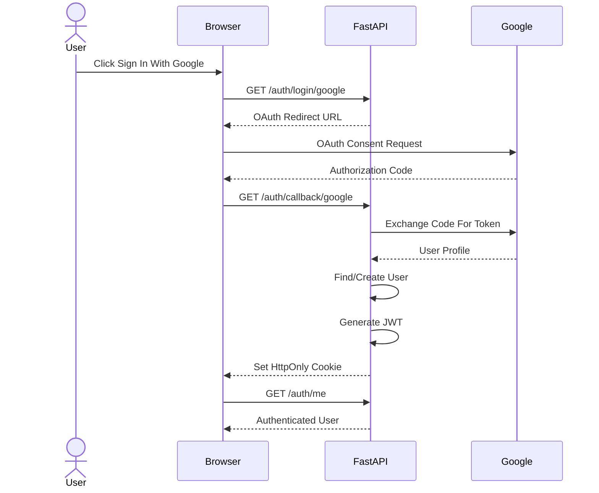
```mermaid
sequenceDiagram

actor User
participant Browser
participant FastAPI
participant Google

User->>Browser: Click Sign In With Google

Browser->>FastAPI: GET /auth/login/google
FastAPI-->>Browser: OAuth Redirect URL

Browser->>Google: OAuth Consent Request

Google-->>Browser: Authorization Code

Browser->>FastAPI: GET /auth/callback/google

FastAPI->>Google: Exchange Code For Token
Google-->>FastAPI: User Profile

FastAPI->>FastAPI: Find/Create User
FastAPI->>FastAPI: Generate JWT
FastAPI-->>Browser: Set HttpOnly Cookie

Browser->>FastAPI: GET /auth/me

FastAPI-->>Browser: Authenticated User
```

---

# 2. Current User Session Validation

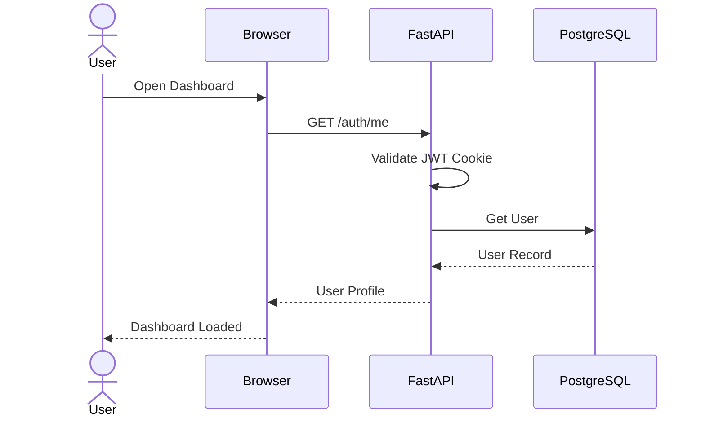
```mermaid
sequenceDiagram

actor User
participant Browser
participant FastAPI
participant PostgreSQL

User->>Browser: Open Dashboard

Browser->>FastAPI: GET /auth/me

FastAPI->>FastAPI: Validate JWT Cookie

FastAPI->>PostgreSQL: Get User

PostgreSQL-->>FastAPI: User Record

FastAPI-->>Browser: User Profile

Browser-->>User: Dashboard Loaded
```

---

# 3. Logout Flow

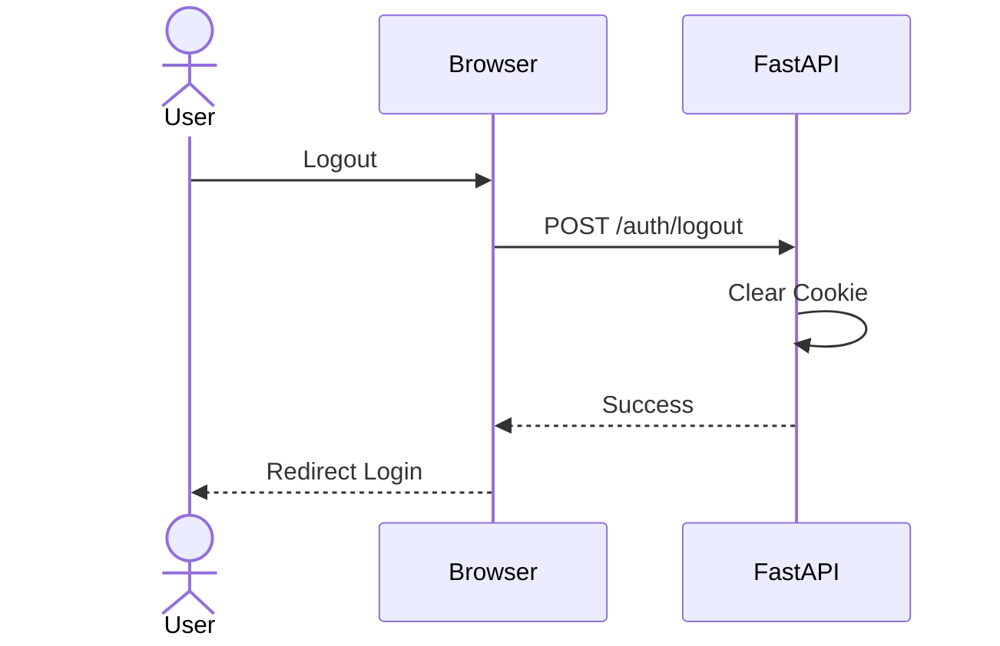
```mermaid
sequenceDiagram

actor User
participant Browser
participant FastAPI

User->>Browser: Logout

Browser->>FastAPI: POST /auth/logout

FastAPI->>FastAPI: Clear Cookie

FastAPI-->>Browser: Success

Browser-->>User: Redirect Login
```

---

# 4. Voice Session Creation

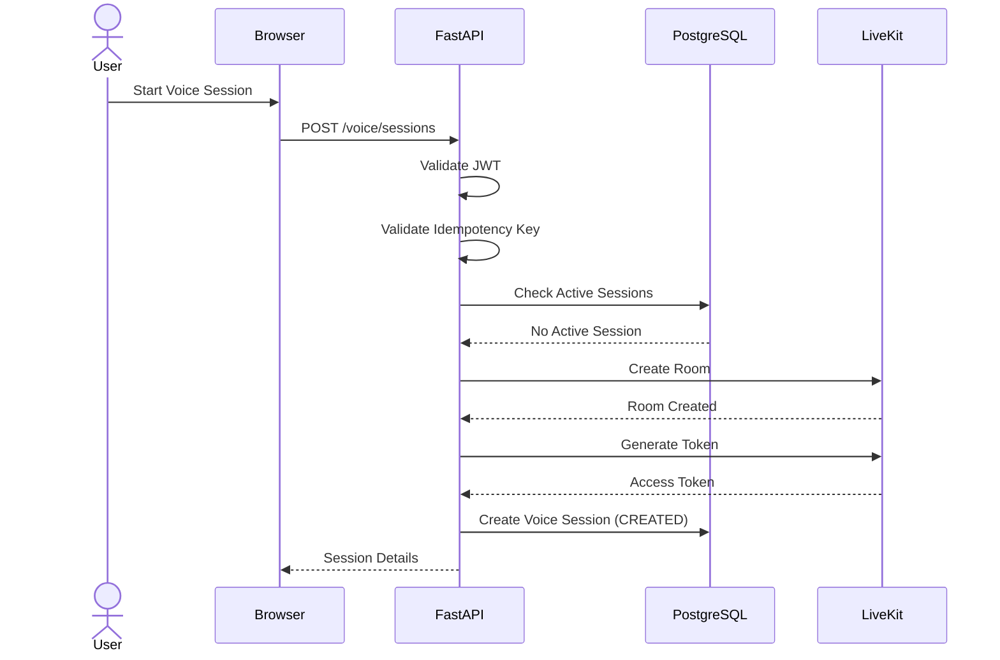
```mermaid
sequenceDiagram

actor User
participant Browser
participant FastAPI
participant PostgreSQL
participant LiveKit

User->>Browser: Start Voice Session

Browser->>FastAPI: POST /voice/sessions

FastAPI->>FastAPI: Validate JWT
FastAPI->>FastAPI: Validate Idempotency Key

FastAPI->>PostgreSQL: Check Active Sessions

PostgreSQL-->>FastAPI: No Active Session

FastAPI->>LiveKit: Create Room

LiveKit-->>FastAPI: Room Created

FastAPI->>LiveKit: Generate Token

LiveKit-->>FastAPI: Access Token

FastAPI->>PostgreSQL: Create Voice Session (CREATED)

FastAPI-->>Browser: Session Details
```

---

# 5. LiveKit Connection Flow

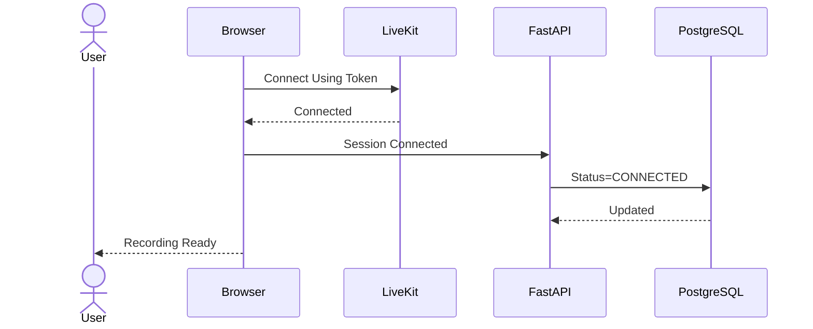
```mermaid
sequenceDiagram

actor User
participant Browser
participant LiveKit
participant FastAPI
participant PostgreSQL

Browser->>LiveKit: Connect Using Token

LiveKit-->>Browser: Connected

Browser->>FastAPI: Session Connected

FastAPI->>PostgreSQL: Status=CONNECTED

PostgreSQL-->>FastAPI: Updated

Browser-->>User: Recording Ready
```

---

# 6. Voice Recording Lifecycle

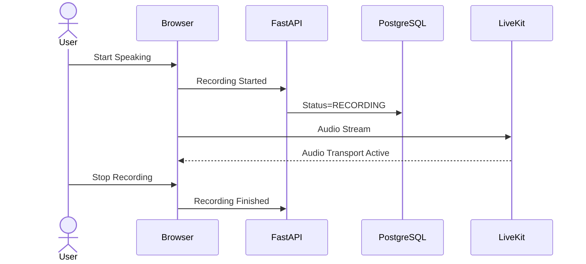
```mermaid
sequenceDiagram

actor User
participant Browser
participant FastAPI
participant PostgreSQL
participant LiveKit

User->>Browser: Start Speaking

Browser->>FastAPI: Recording Started

FastAPI->>PostgreSQL: Status=RECORDING

Browser->>LiveKit: Audio Stream

LiveKit-->>Browser: Audio Transport Active

User->>Browser: Stop Recording

Browser->>FastAPI: Recording Finished
```

---

# 7. Voice Session Completion

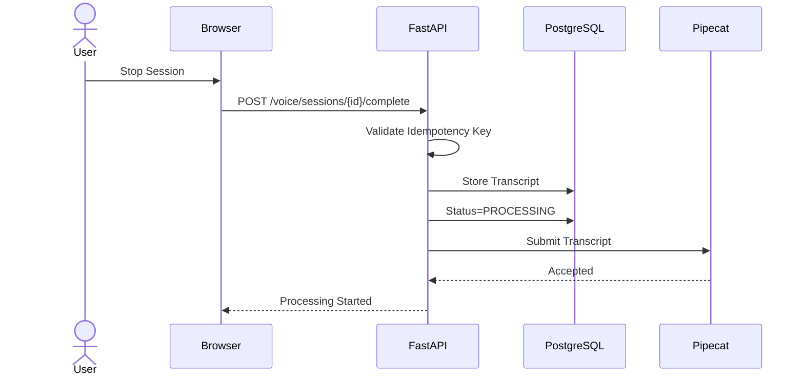
```mermaid
sequenceDiagram

actor User
participant Browser
participant FastAPI
participant PostgreSQL
participant Pipecat

User->>Browser: Stop Session

Browser->>FastAPI: POST /voice/sessions/{id}/complete

FastAPI->>FastAPI: Validate Idempotency Key

FastAPI->>PostgreSQL: Store Transcript

FastAPI->>PostgreSQL: Status=PROCESSING

FastAPI->>Pipecat: Submit Transcript

Pipecat-->>FastAPI: Accepted

FastAPI-->>Browser: Processing Started
```

---

# 8. Pipecat Extraction Processing

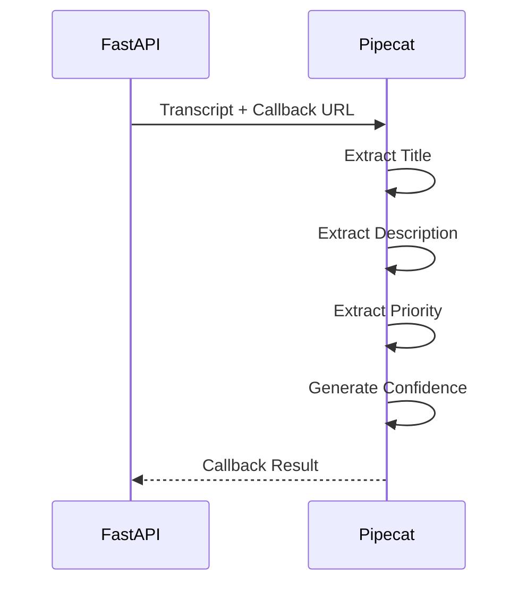
```mermaid
sequenceDiagram

participant FastAPI
participant Pipecat

FastAPI->>Pipecat: Transcript + Callback URL

Pipecat->>Pipecat: Extract Title

Pipecat->>Pipecat: Extract Description

Pipecat->>Pipecat: Extract Priority

Pipecat->>Pipecat: Generate Confidence

Pipecat-->>FastAPI: Callback Result
```

---

# 9. Pipecat Callback And Ticket Creation

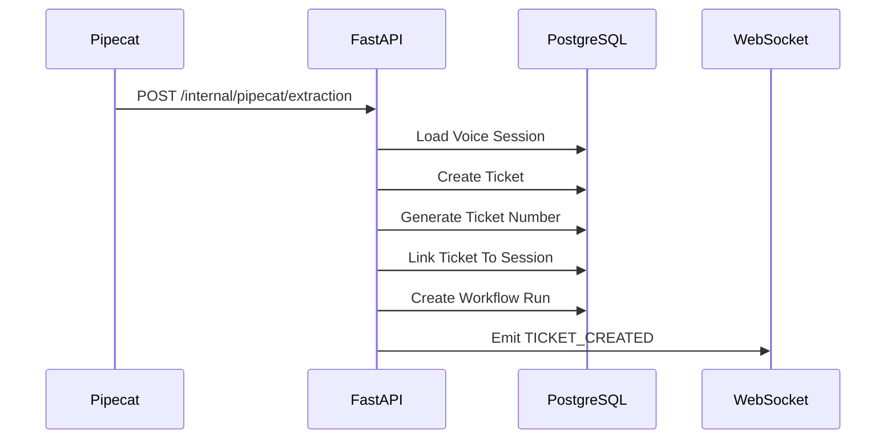
```mermaid
sequenceDiagram

participant Pipecat
participant FastAPI
participant PostgreSQL
participant WebSocket

Pipecat->>FastAPI: POST /internal/pipecat/extraction

FastAPI->>PostgreSQL: Load Voice Session

FastAPI->>PostgreSQL: Create Ticket

FastAPI->>PostgreSQL: Generate Ticket Number

FastAPI->>PostgreSQL: Link Ticket To Session

FastAPI->>PostgreSQL: Create Workflow Run

FastAPI->>WebSocket: Emit TICKET_CREATED
```

---

# 10. Workflow Trigger Flow

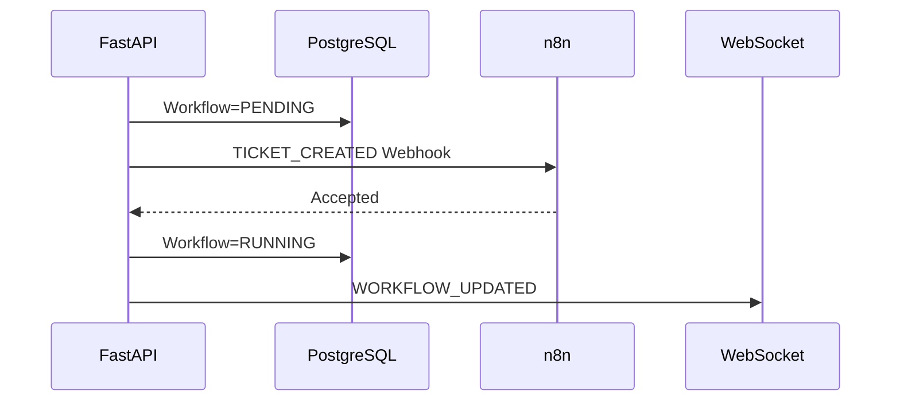
```mermaid
sequenceDiagram

participant FastAPI
participant PostgreSQL
participant n8n
participant WebSocket

FastAPI->>PostgreSQL: Workflow=PENDING

FastAPI->>n8n: TICKET_CREATED Webhook

n8n-->>FastAPI: Accepted

FastAPI->>PostgreSQL: Workflow=RUNNING

FastAPI->>WebSocket: WORKFLOW_UPDATED
```

---

# 11. Workflow Success Flow

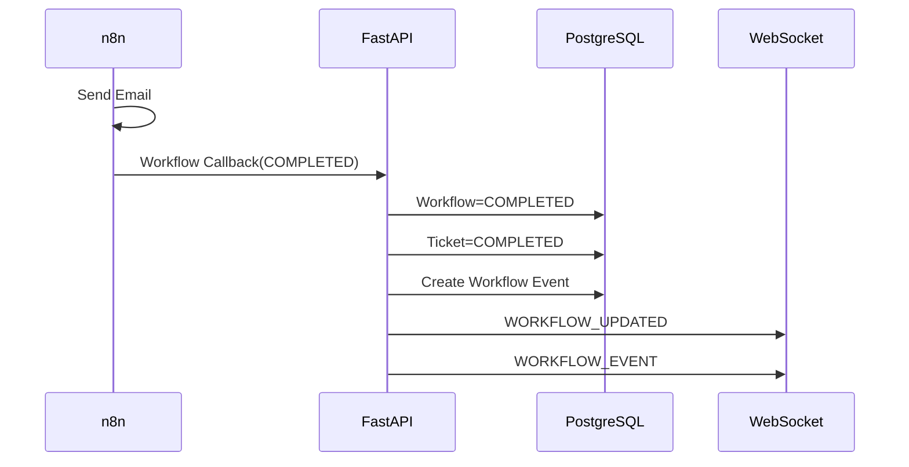
```mermaid
sequenceDiagram

participant n8n
participant FastAPI
participant PostgreSQL
participant WebSocket

n8n->>n8n: Send Email

n8n->>FastAPI: Workflow Callback(COMPLETED)

FastAPI->>PostgreSQL: Workflow=COMPLETED

FastAPI->>PostgreSQL: Ticket=COMPLETED

FastAPI->>PostgreSQL: Create Workflow Event

FastAPI->>WebSocket: WORKFLOW_UPDATED

FastAPI->>WebSocket: WORKFLOW_EVENT
```

---

# 12. Workflow Failure Flow

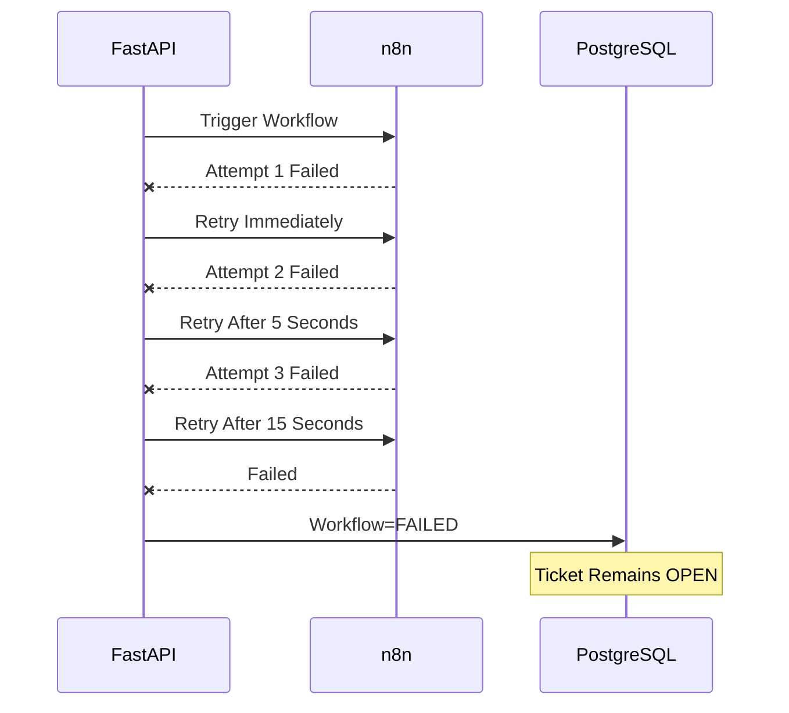
```mermaid
sequenceDiagram

participant FastAPI
participant n8n
participant PostgreSQL

FastAPI->>n8n: Trigger Workflow

n8n--xFastAPI: Attempt 1 Failed

FastAPI->>n8n: Retry Immediately

n8n--xFastAPI: Attempt 2 Failed

FastAPI->>n8n: Retry After 5 Seconds

n8n--xFastAPI: Attempt 3 Failed

FastAPI->>n8n: Retry After 15 Seconds

n8n--xFastAPI: Failed

FastAPI->>PostgreSQL: Workflow=FAILED

Note over PostgreSQL: Ticket Remains OPEN
```

---

# 13. WebSocket Connection Flow

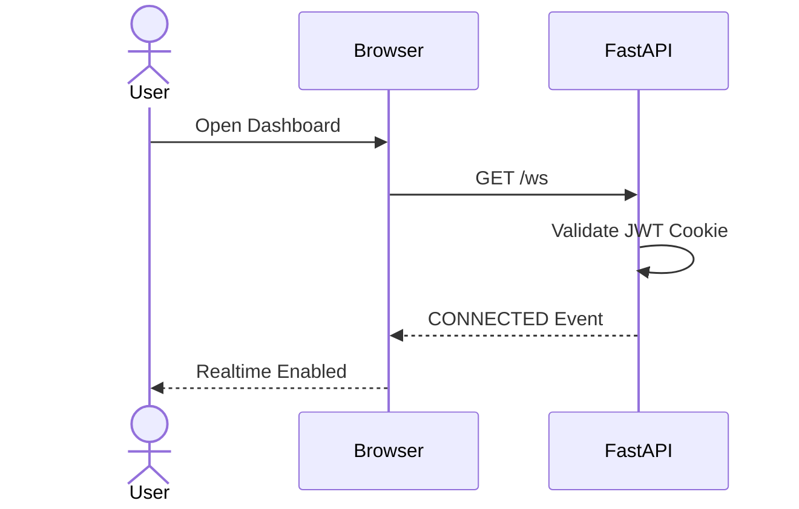
```mermaid
sequenceDiagram

actor User
participant Browser
participant FastAPI

User->>Browser: Open Dashboard

Browser->>FastAPI: GET /ws

FastAPI->>FastAPI: Validate JWT Cookie

FastAPI-->>Browser: CONNECTED Event

Browser-->>User: Realtime Enabled
```

---

# 14. Dashboard Recovery After Refresh

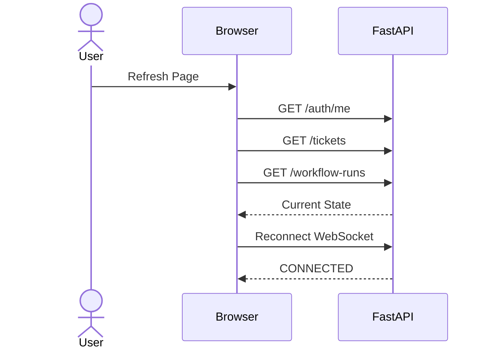
```mermaid
sequenceDiagram

actor User
participant Browser
participant FastAPI

User->>Browser: Refresh Page

Browser->>FastAPI: GET /auth/me

Browser->>FastAPI: GET /tickets

Browser->>FastAPI: GET /workflow-runs

FastAPI-->>Browser: Current State

Browser->>FastAPI: Reconnect WebSocket

FastAPI-->>Browser: CONNECTED
```

---

# 15. Get Ticket Flow

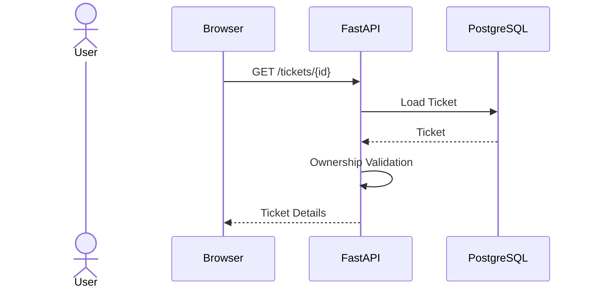
```mermaid
sequenceDiagram

actor User
participant Browser
participant FastAPI
participant PostgreSQL

Browser->>FastAPI: GET /tickets/{id}

FastAPI->>PostgreSQL: Load Ticket

PostgreSQL-->>FastAPI: Ticket

FastAPI->>FastAPI: Ownership Validation

FastAPI-->>Browser: Ticket Details
```

---

# 16. List Tickets Flow

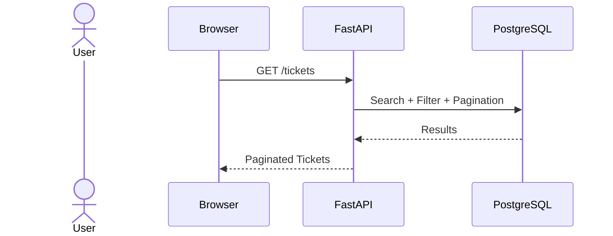
```mermaid
sequenceDiagram

actor User
participant Browser
participant FastAPI
participant PostgreSQL

Browser->>FastAPI: GET /tickets

FastAPI->>PostgreSQL: Search + Filter + Pagination

PostgreSQL-->>FastAPI: Results

FastAPI-->>Browser: Paginated Tickets
```

---

# 17. Get Workflow Run Flow

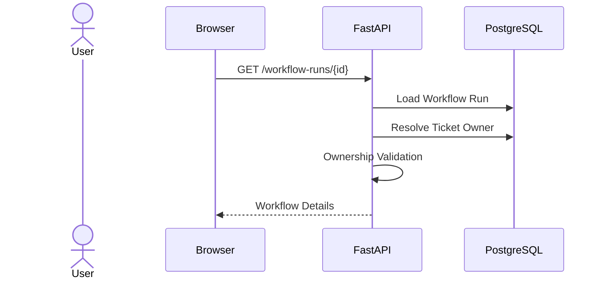
```mermaid
sequenceDiagram

actor User
participant Browser
participant FastAPI
participant PostgreSQL

Browser->>FastAPI: GET /workflow-runs/{id}

FastAPI->>PostgreSQL: Load Workflow Run

FastAPI->>PostgreSQL: Resolve Ticket Owner

FastAPI->>FastAPI: Ownership Validation

FastAPI-->>Browser: Workflow Details
```

---

# 18. Correlation ID Propagation

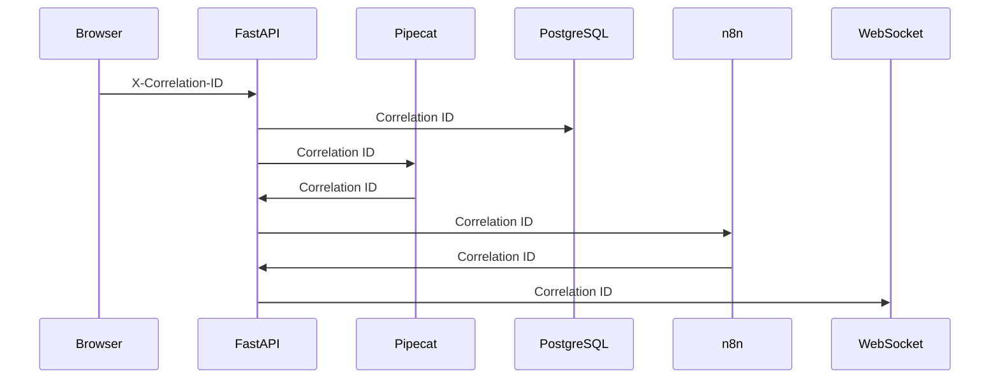
```mermaid
sequenceDiagram

participant Browser
participant FastAPI
participant Pipecat
participant PostgreSQL
participant n8n
participant WebSocket

Browser->>FastAPI: X-Correlation-ID

FastAPI->>PostgreSQL: Correlation ID

FastAPI->>Pipecat: Correlation ID

Pipecat->>FastAPI: Correlation ID

FastAPI->>n8n: Correlation ID

n8n->>FastAPI: Correlation ID

FastAPI->>WebSocket: Correlation ID
```

---

# 19. Idempotency Protection Flow

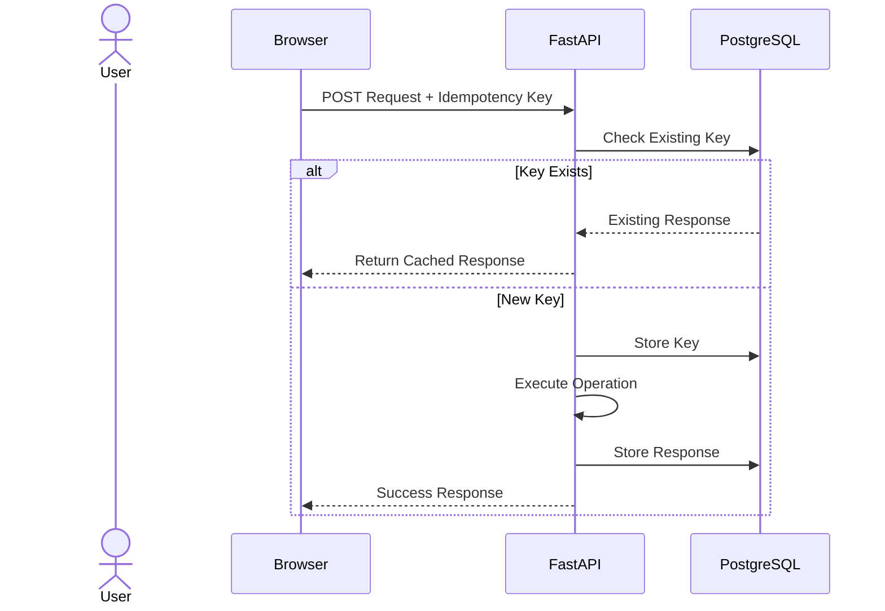
```mermaid
sequenceDiagram

actor User
participant Browser
participant FastAPI
participant PostgreSQL

Browser->>FastAPI: POST Request + Idempotency Key

FastAPI->>PostgreSQL: Check Existing Key

alt Key Exists

PostgreSQL-->>FastAPI: Existing Response

FastAPI-->>Browser: Return Cached Response

else New Key

FastAPI->>PostgreSQL: Store Key

FastAPI->>FastAPI: Execute Operation

FastAPI->>PostgreSQL: Store Response

FastAPI-->>Browser: Success Response

end
```

---

# 20. Health Check Flow

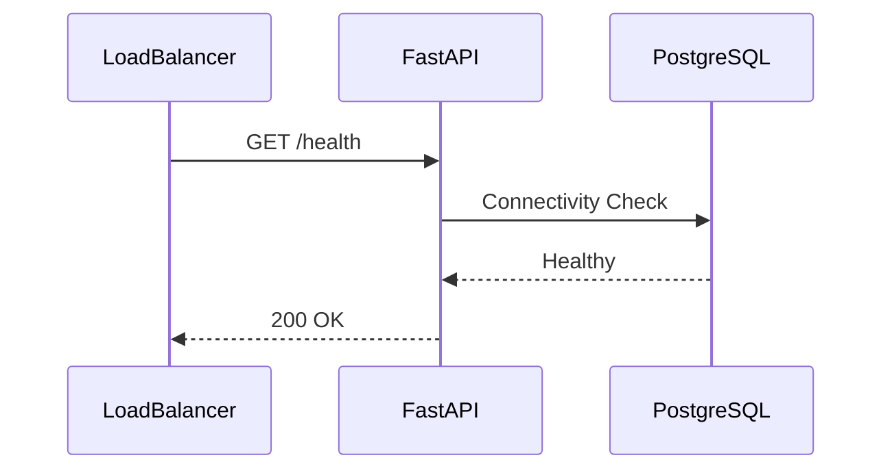
```mermaid
sequenceDiagram

participant LoadBalancer
participant FastAPI
participant PostgreSQL

LoadBalancer->>FastAPI: GET /health

FastAPI->>PostgreSQL: Connectivity Check

PostgreSQL-->>FastAPI: Healthy

FastAPI-->>LoadBalancer: 200 OK
```

---

# System State Transitions

## Voice Session State Machine

```mermaid
stateDiagram-v2

[*] --> CREATED

CREATED --> CONNECTED

CONNECTED --> RECORDING

RECORDING --> PROCESSING

PROCESSING --> COMPLETED

CONNECTED --> TIMEOUT

PROCESSING --> FAILED

TIMEOUT --> [*]

FAILED --> [*]

COMPLETED --> [*]
```

---

## Workflow State Machine

```mermaid
stateDiagram-v2

[*] --> PENDING

PENDING --> RUNNING

RUNNING --> COMPLETED

RUNNING --> FAILED

COMPLETED --> [*]

FAILED --> [*]
```

---

# Notes

1. WebSocket connection is established immediately after dashboard load.
2. Transcript updates are not streamed in real-time.
3. Ticket creation occurs asynchronously through Pipecat callback.
4. Workflow status becomes RUNNING only after successful n8n webhook acceptance.
5. Correlation IDs are propagated across all services.
6. Idempotency applies to:

   * POST /voice/sessions
   * POST /voice/sessions/{session_id}/complete
7. Workflow failures do not change ticket status from OPEN.
